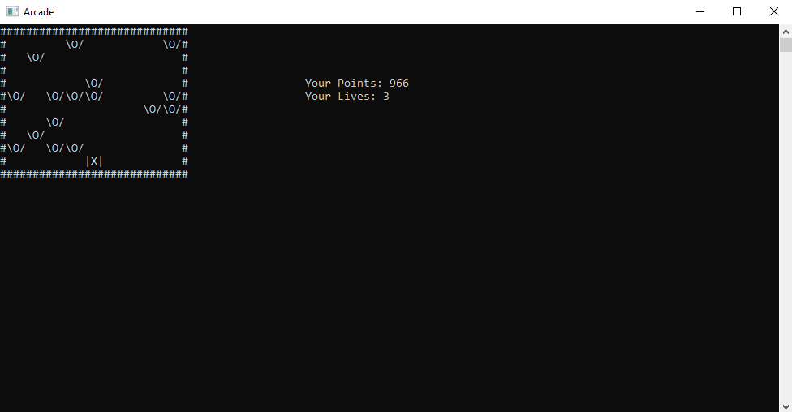

<!-- ABOUT THE PROJECT -->
## About The Project

A small console game in which you ("|X|") need to dodge enemies ("\O/") dropped from above. 



<!-- GETTING STARTED -->
## Getting Started

You can get the latest self contained version of the application under the [Releases](https://github.com/ActuallyMirak/ConsoleGame/releases).

On start up the application will prompt you for all the information it needs and also provide a overview of what to expect.
-> Theses instructions are all given in German

The application can be used using either the arrow or A and D keys

### Prerequisites

The application given in the [Releases](https://github.com/ActuallyMirak/ConsoleGame/releases) was build for "win-x86". Therefor any other systems will need to compile the projects for itself using any method of their choosing.

### Running the application

The application can be run by double clicking or executing it in a terminal

   ```sh
   .\SampleProgram.exe
   ```